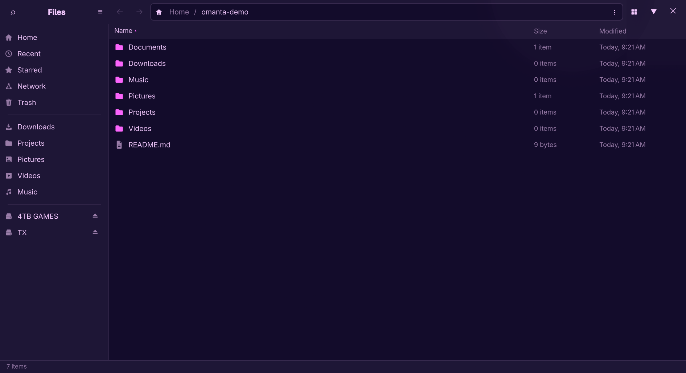

# omanta

A native file manager for [Omarchy](https://omarchy.org), built with Qt Quick
and GIO as a drop-in replacement for GNOME Files (Nautilus) — same
keybindings, same launch semantics, same D-Bus integration, themed by your
Omarchy theme.



> **Testing preview.** omanta installs *alongside* your existing file manager
> and touches nothing until you opt in. A bundled switcher flips between the
> two and restores the stock setup byte-identically. Please file issues for
> anything that doesn't behave exactly as you'd expect.

## What you get

- List and grid views, tabs, split view (F3), tree expansion, breadcrumbs +
  Ctrl+L, type-ahead, configurable columns
- All write operations — copy/cut/paste (system clipboard, interops with
  other file managers), move, rename, batch rename, trash, delete — with
  undo/redo and a progress popover
- Thumbnails (images, video, PDF) via the freedesktop spec, sharing the
  system-wide cache
- Places sidebar: devices with mount/unmount/eject, Network (`smb://`,
  `sftp://`) with credential prompts, Trash, Recent, Starred, bookmarks
- Search: recursive filename plus full-text (via `localsearch`), date and
  type filters
- Compress/extract (zip, tar.xz, 7z, encrypted zip), "Extract to…"
- Omarchy theming end to end — follows your active theme live, not just
  light/dark
- Custom context-menu actions from simple TOML files — no extension API
  needed (Omarchy's transcode/LocalSend/Omarchy-Send menu items ship
  included, plus Dropbox share links if you use Dropbox)
- Multi-window single instance, `org.freedesktop.FileManager1` — "open
  containing folder" from browsers and other apps just works

## Install

Grab the package from the [latest release](https://github.com/28allday/omanta/releases)
and install it:

```bash
curl -LO https://github.com/28allday/omanta/releases/download/v0.1.3/omanta-0.1.3-1-x86_64.pkg.tar.zst
sudo pacman -U omanta-0.1.3-1-x86_64.pkg.tar.zst
```

(The package is unsigned, so pacman won't install it straight from a URL —
download it first and install the local file.)

Or build it yourself:

```bash
git clone https://github.com/28allday/omanta.git
cd omanta/packaging
makepkg -si
```

Installing changes none of your defaults — Nautilus (or whatever you use)
remains the file manager until you switch.

## Switching

```bash
omanta-switch omanta     # make omanta the default
omanta-switch nautilus   # back to stock
omanta-switch toggle     # flip
omanta-switch status     # what's active right now
```

Or from the desktop: run `omanta-switch install-menu` once and the Omarchy
Toggle menu (`SUPER+CTRL+O`) gains an **Omanta File Manager** row — select
it to switch either way. It shows a ✓ while omanta is the default, so the
menu doubles as a status check. The row appears instantly (no shell
restart) and `omanta-switch remove-menu` takes it out again.

Switching makes omanta (or Nautilus) the default everywhere at once:
`SUPER+SHIFT+F`, folders opened from other apps, and double-clicked
archives. It works by flipping the xdg-mime defaults and writing a
managed, clearly-marked block to `~/.config/hypr/bindings.lua` —
Omarchy's own files are never modified, no logout needed, and switching
back restores your configuration byte-for-byte. One note: whichever file
manager has windows open keeps the "open containing folder" D-Bus
service until its last window closes, so close the other one's windows
after switching.

## Uninstall

```bash
omanta-switch nautilus && omanta-switch remove-menu   # if you switched
sudo pacman -R omanta
```

## Requirements

Arch with Omarchy. Dependencies (`qt6-base`, `qt6-declarative`, `glib2`,
`gvfs`, `libarchive`, `tinysparql`) are all in Omarchy's default install or
pulled automatically. Optional: `gvfs-smb`/`gvfs-mtp`/`gvfs-gphoto2` for
network shares, phones and cameras, `ffmpegthumbnailer` for video
thumbnails, `localsearch` for full-text search.

## Hacking on it

Three scripts are the whole developer interface, and they work from any
directory:

```bash
./bin/build      # cmake + ninja into build/, then run ./build/omanta
./bin/test       # the headless suites (ctest, ~17s)
./bin/install    # user-local install: ~/.local/bin symlink, desktop entry, icon
```

`./bin/install` never touches `/usr` or pacman, and installs alongside your
existing file manager — later rebuilds are picked up without reinstalling. For
a real package instead, use the `makepkg -si` route above.

Requires `cmake`, `ninja` and the Qt 6 development packages in addition to the
runtime dependencies above.

## License

MIT
